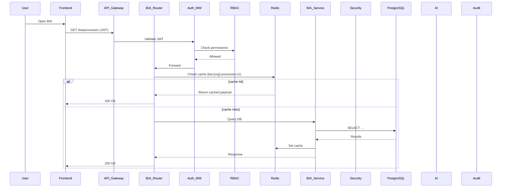

# BIA Module — Enterprise Technical Documentation

> Single-source, enterprise-grade technical documentation for the Business Impact Analysis (BIA) module.

Table of contents

- [Executive summary & overview](#executive-summary--overview)
- [Architecture overview](#architecture-overview)
- [Data models & database schema](#data-models--database-schema)
- [API endpoints reference](#api-endpoints-reference)
- [Security architecture](#security-architecture)
- [Caching strategy](#caching-strategy)
- [AI integration](#ai-integration)
- [Frontend integration](#frontend-integration)
- [Deployment & configuration](#deployment--configuration)
- [Error handling & troubleshooting](#error-handling--troubleshooting)
- [API usage examples](#api-usage-examples)
- [Best practices & recommendations](#best-practices--recommendations)
- [Appendices](#appendices)

---

## Executive summary & overview

Purpose

- The BIA module provides a complete toolkit for assessing business impact across organizational processes, supporting RTO/RPO and criticality assessment, dependency mapping, mitigation tracking and encrypted snapshot versioning.
- Designed for Business Continuity Managers, Process Owners, Department Heads and System Administrators.

Business value & standards alignment

- Aligns with ISO 22301 (business continuity management), NIST SP 800-34 (contingency planning) and ISO 27001 (information security).\
- Supports auditability and traceability through encrypted snapshots and a robust audit log.

Key capabilities

- Process impact analysis with structured impact matrices (financial, operational, regulatory dimensions).\
- Dependency graph generation and visualization.\
- Impact heatmap generation and prioritization.\
- Mitigation task lifecycle management (create, update, complete).\
- Encrypted snapshot storage and versioning (AES-256-GCM).\
- Cache-first performance model with Redis (TLS-enabled recommended).\
- Optional AI-assisted analysis generation and suggestions.

Target audience

- BCM Coordinators, Process Owners, Department Heads, Security/Compliance teams, Platform Engineers.

---

## Architecture overview

Technology stack (representative)

- Backend: FastAPI (asynchronous), SQLAlchemy ORM (PostgreSQL), Alembic migrations.\
- Data stores: PostgreSQL (primary relational data), MongoDB (document storage or auxiliary data), Redis (cache).\
- Frontend: React + Vite.\
- AI: Groq / Google Gemini integrations (optional).\
- Security: JWT, RBAC, AES-256-GCM encryption, HKDF key derivation.

Mermaid architecture diagram

```mermaid
flowchart LR
  subgraph FE[Frontend]
    F[React Vite App]
  end
  subgraph GW[API Gateway]
    GW1[Gateway / Load Balancer]
  end
  subgraph BE[Backend]
    A[BIA Router]
    S[BIA Service Layer]
    sec[Security Module]
    rbac[RBAC Service]
    cache[Redis (TLS)]
    db[PostgreSQL]
    mongo[MongoDB]
    ai[AI Service (Groq / Gemini)]
    audit[Audit Logger]
  end

  F -->|HTTPS (JWT)| GW1
  GW1 -->|Internal HTTPS| A
  A --> rbac
  A --> cache
  A --> S
  S --> db
  S --> mongo
  S --> cache
  S --> sec
  S --> ai
  S --> audit
```

Sequence (high-level)



Security layers

- Transport: HTTPS/TLS enforced for API and Redis using rediss:// where supported.\
- Authentication: JWT tokens (HS256 by default), short TTL recommended.\
- Authorization: RBAC enforced per endpoint.\
- Data-at-rest: AES-256-GCM encrypted snapshots for sensitive BIA payloads.

---

## Data models & database schema

Note: field names and types reference actual tables in the codebase. Keep schemas in sync with `app/models/bia_models.py` and migrations.

BIAProcessInfo (table: `bia_process_info`)

- id (UUID PK)
- process_id (UUID FK -> process)
- description (text)
- peak_period (string)
- spoc (string)
- review_status (enum: Draft|In Review|Approved)
- created_at, updated_at (timestamps)

ProcessImpactAnalysis (table: `process_impact_analysis`)

- id (UUID PK)
- process_id (UUID FK)
- rto (string)
- mtpd (string)
- impact_data (JSON/text) — canonical JSON structure mapping target processes to impact scores
- highest_impact (JSON/text) — derived highest-impact metadata
- is_critical (boolean)
- rationale (text)
- created_at, updated_at

BIASnapshot (table: `bia_snapshots` — recommended name)

- id (UUID PK)
- organization_id (UUID FK)
- version (int)
- snapshot_data (BYTEA / TEXT: encrypted payload — base64); AES-256-GCM
- encryption_metadata (JSON): {dek_version, iv_base64, tag_base64, algorithm}
- saved_by (user id)
- source (enum: HUMAN|AI)
- checksum (SHA-256 hex)
- created_at

BiaAuditLog (table: `bia_audit_logs`)

- id (UUID PK)
- snapshot_id (UUID FK)
- action (enum: SAVE|APPROVE|REJECT|ROLLBACK|CREATE|UPDATE)
- user_id (UUID)
- organization_id (UUID)
- details (JSON) — pre/post state differences
- request_id (string)
- created_at

ER / indexes

- Index `ix_process_impact_process_id` on `process_impact_analysis(process_id)`
- Index `ix_bia_process_organization` on `bia_process_info(organization_id)` if multi-org
- Unique constraint on `bia_impact_scales.organization_id`

JSON structure examples

- impact_data sample:

```json
{
  "targets": {
    "<target_process_uuid>": {"score": 8.2, "impact": 4, "likelihood": 2},
    "<other_process_uuid>": {"score": 3.5, "impact": 2, "likelihood": 1}
  },
  "summary": {"max_score": 8.2, "avg_score": 5.85}
}
```

---

## API endpoints reference

Notes

- All endpoints require JWT unless marked as public.\
- RBAC checks documented per endpoint; module licensing verification performed where applicable.
- Errors: use standard HTTP codes (400/401/403/404/422/500). Include helpful error messages and request_id for correlating logs.

Example endpoint signature and example payloads below (trimmed for clarity). Keep the auto-generated docs under `BIA_API_DOCUMENTATION.md` in sync.

1) GET /bia/overview?organization_id={uuid}

- Purpose: Return consolidated overview for frontend dashboards (heatmap, critical counts, mitigations, dependencies).
- Auth: JWT (read scope)
- Caching: Key `bia:overview:{org_id}:v1` TTL default 300s
- Response: `BIAOverviewResponse` (see schemas)

2) POST /bia/processes

- Purpose: Retrieve process list with `has_bia_info` flag.
- Body: {organization_id, department_name?, subdepartment_name?}
- Caching: `bia:{org_id}:processes:{dept}:{subdept}:v1` TTL 1800s

3) POST /bia/impact-analysis

- Purpose: Create impact analysis (optionally enriched by AI)
- Body: ProcessImpactAnalysisCreate (process_id, rto, mtpd, impact_data)
- Side effects: invalidate `bia:{org}:impact*` cache
- Auditing: log create action

4) POST /bia/save

- Purpose: Save full BIA snapshot (encrypted)
- Body: {organization_id, payload, version_note}
- Process: RBAC check → encrypt payload → store snapshot → create audit log → invalidate caches
- Response: {snapshot_id, version}

5) GET /bia/organization/{organization_id}/dependency-graph

- Purpose: Return nodes & edges for dependency visualization
- Response: {nodes: [{id,name,meta}], edges: [{from,to,weight}]}

6) POST /bia/mitigation-task/{task_id}/complete

- Purpose: Mark mitigation as completed and optionally broadcast SSE/WebSocket event to connected clients.
- Side effects: update task status, set completed_at, invalidate caches `bia:{org}:mitigations*`.

7) GET /bia/organization/{organization_id}/heatmap

- Purpose: Return heatmap cells with riskScore, impact, likelihood for rendering frontend grid.

Full request/response examples

- Keep a machine-readable swagger/openapi export in the repo (FastAPI auto-generated) and supplement with curated examples in this doc.

---

## Security architecture

Overview

- Defense-in-depth model: TLS for transport, JWT for authentication, RBAC for authorization, AES-256-GCM for at-rest encryption of snapshots, and audit trails for operations.

Encryption

- Algorithm: AES-256-GCM.\
- IV size: 96 bits recommended (12 bytes).\
- Tag size: 128 bits (16 bytes).\
- Library: `cryptography` Python library (recommended APIs: AESGCM).

Key derivation and management

- Master key: `BIA_ENCRYPTION_MASTER_KEY` (store in secrets manager).\
- Per-org DEK: derived using HKDF-SHA256 with `info = f"BIA-DEK-{org_id}-{dek_version}"`.\
- Rotation: support key versioning; maintain dek_version in `encryption_metadata` for each snapshot.\
- Rotation cadence: recommended 90 days (policy-driven).

Encryption flow (save)

1. Serialize snapshot to canonical JSON (sorted keys).\
2. Generate random IV (12 bytes).\
3. Derive DEK via HKDF(master_key, info).\
4. Encrypt with AES-256-GCM: ciphertext + tag.\
5. Store base64 components (iv, tag, ciphertext) and dek_version in `encryption_metadata`.

Decryption flow (read)

1. Load encryption metadata and base64 decode IV, tag, ciphertext.\
2. Derive DEK from master key and dek_version info.\
3. Decrypt and verify tag.\
4. Parse JSON into native objects.

Integrity

- Additionally compute SHA-256 checksum of the plaintext and store in `BIASnapshot.checksum` for tamper detection and quick validation.

Authentication & authorization

- JWT tokens (HS256) with payload: {sub: <user_id>, exp: <timestamp>, client_id, roles: []}.\
- Token TTL: short-lived (recommended 30 minutes), refresh tokens managed separately.\
- RBAC: role-to-permission mapping evaluated through `require_permission(resource, action)`.\
- AD/LDAP integration: optional LDAPS-based user lookup and group extraction for role mapping.

Transport security

- Enforce TLS for HTTP endpoints. Use TLS for Redis (rediss://) and for any external services (AI APIs).\
- Use HSTS, secure cookies (if used), and CORS allowlist (frontend origin only in production).

Module licensing & access gating

- BIA module license verified prior to access. Store license state in an organizations table (JSONB `licensed_modules`).

---

## Caching strategy

Redis configuration

- Provider: Upstash or managed Redis with TLS (recommended).\
- Connection string pattern: `rediss://default:{password}@<host>:<port>` when TLS enabled.
- Connection pattern: singleton client instance per process with reconnect/backoff.

Key design & TTLs

- Keys: versioned, namespaced. Example: `bia:{org_id}:processes:{dept}:{subdept}:v1`.
- Default TTL: `CACHE_TTL` environment variable (default 1800 seconds / 30 minutes).
- Cache payload format: JSON with metadata wrapper: {data, org_id, version, cached_at, source}

Invalidation strategy

- Events triggering invalidation: impact analysis create/update, snapshot save, mitigation updates, approval state changes.\
- Approach: delete targeted keys by pattern using `SCAN` + batch `DEL` (avoid `KEYS` on production).\
- Batch size: 100 keys per iteration recommended.

Fallback

- If Redis is unavailable, the app should continue in degraded mode and read from DB. Implement exponential backoff for cache writes.

Performance expectations

- Cache hit target: >80% for dashboard endpoints.\
- Typical latencies: cache hits <10ms, DB reads 50-200ms (depends on query complexity).

---

## AI integration

Supported providers

- Groq (fast inference) — `GROQ_API_KEY` required.\
- Google Gemini — `GEMINI_API_KEY` required.

Use cases

- Auto-generate impact analysis rationale.\
- Suggest impact matrix values for similar processes.\
- Generate human readable process descriptions and peak period predictions.

Integration pattern

- Backend `BIA Service` orchestrates requests to AI providers.\
- Prompting: include structured context and example JSON to enforce schema-like outputs.\
- Safety: validate the returned JSON schema before persisting.

Operational controls

- Timeouts: 30s request timeout.\
- Retries: 2 retries with exponential backoff.\
- Fall back: if AI fails, return a conservative default or decline to suggest.

Compliance & governance

- Log prompt and model outputs for audit (redact any PII).\
- Review prompted suggestions before auto-committing to DB (approval workflow).

---

## Frontend integration

Base URL and auth

- Base API URL: `http://localhost:8000/bia` in development (use https and CORS allowlist in production).\
- All calls use JWT in `Authorization: Bearer <token>` header.

Important endpoints & functions

- getProcessesForBIA, createProcessBIAInfo, updateProcessBIAInfo, bulkUpdateProcessBIAInfo
- getProcessImpactAnalysis, createProcessImpactAnalysis, updateProcessImpactAnalysis, bulkUpdateImpactAnalysis
- getOrganizationImpactAnalysis, getHeatmapData, getDependencyGraph, getAlerts

React components & state

- `BIAContainer.jsx`: multi-step wizard and entry point.\
- `BusinessImpactAnalysis.jsx`: matrix editor with AI suggestions and save snapshot action.\
- `ImpactHeatMap.jsx`, `ProcessDependencyGraph.jsx`: visualization components.\
- Context providers: `BIADataContext`, `ImpactMatrixContext`, `AuditTrailContext`, `RoleContext`.

CORS and local dev

- Ensure backend CORS middleware includes `http://localhost:5173` during frontend development.\
- In production, use a locked CORS allowlist and enable HTTPS.

---

## Deployment & configuration

Environment variables

- `POSTGRES_SERVER`, `POSTGRES_USER`, `POSTGRES_PASSWORD`, `POSTGRES_DB`, `POSTGRES_PORT`
- `MONGODB_URL`, `MONGODB_DB`
- `REDIS_URL`, `REDIS_SSL`, `CACHE_TTL`
- `SECRET_KEY`, `BIA_ENCRYPTION_MASTER_KEY`, `BIA_ENCRYPTION_KEY_ROTATION_DAYS`
- `AD_SERVER_URI`, `AD_BASE_DN`, `AD_ADMIN_USER`, `AD_ADMIN_PASSWORD`, `AD_DOMAIN`
- `GROQ_API_KEY`, `GEMINI_API_KEY`
- `PORT`, `DEBUG`

Dependencies (representative)

- Backend: fastapi, uvicorn, sqlalchemy, alembic, pydantic, psycopg2-binary, pymongo, redis, python-jose, cryptography
- AI SDKs: groq, google-generativeai

Database migrations

- Use Alembic: `alembic upgrade head`. Keep migration files in `alembic/versions` and ensure version history matches database state.

Deployment checklist

1. Generate and store strong `SECRET_KEY` and `BIA_ENCRYPTION_MASTER_KEY` in secrets manager.
2. Provision Postgres and MongoDB (managed where possible).
3. Provision Redis with TLS enabled (Upstash or other provider).\
4. Run `alembic upgrade head` after configuring DB connection string.\
5. Configure AD/LDAP if needed.\
6. Configure AI provider keys.\
7. Configure monitoring, backups and alerting.

Scaling & performance

- DB connection pool: configure SQLAlchemy pool size appropriate to instance.\
- Horizontal scale API servers behind load balancer with sticky sessions avoided (JWT stateless).\
- Use Redis for caching hot endpoints and pre-warming caches after deploy if helpful.

---

## Error handling & troubleshooting

Common errors and resolutions

- 400: invalid UUID / missing fields — validate payload against pydantic schemas.\
- 401: invalid/expired token — check JWT secret and token TTL.\
- 403: insufficient permissions/license — verify RBAC role mappings and `licensed_modules`.\
- 404: resource not found — verify UUID and existence in DB.\
- 422: validation error — include field-level message to the client.\
- 500: infrastructure error — check DB, Redis, encryption keys and service logs.

Debugging tips

- Enable DEBUG logging temporarily.\
- Use `verify_db_connection.py` to validate DB connectivity.\
- Use a local Redis client with TLS to validate cache connectivity.\
- Test encrypt/decrypt cycle using the security module utilities.

---

## API usage examples

Note: Replace `{API_BASE}` with your configured base URL and `{JWT}` with a valid token in examples.

Example: Get BIA overview

```bash
curl -H "Authorization: Bearer {JWT}" \
  "{API_BASE}/bia/overview?organization_id=<org_uuid>"
```

Example: Save snapshot (Python)

```python
import requests
headers = {"Authorization": f"Bearer {JWT}", "Content-Type":"application/json"}
payload = {"organization_id": "<org_uuid>", "payload": {...}, "version_note": "end-of-quarter snapshot"}
resp = requests.post(f"{API_BASE}/bia/save", json=payload, headers=headers)
print(resp.json())
```

Example: Mark mitigation complete (JS fetch)

```js
fetch(`${API_BASE}/bia/mitigation-task/${taskId}/complete`, {
  method: 'POST',
  headers: { 'Authorization': `Bearer ${JWT}` }
})
.then(r => r.json())
.then(console.log)
```

---

## Best practices & recommendations

Security

- Rotate keys and secrets regularly (90-day rotation recommended).\
- Use managed secrets (Azure Key Vault / AWS Secrets Manager / HashiCorp Vault).\
- Enforce least-privilege for DB and storage credentials.

Performance

- Use Redis heavily for read-mostly endpoints.\
- Batch bulk updates and use transactions for bulk operations.\
- Add DB indexes for process_id and organization_id.

Data quality

- Require manual approval for AI-proposed changes.\
- Keep an audit trail for all save/approval events.

Maintenance

- Run regular backups of DB and encrypted snapshots.\
- Monitor slow queries and tune indexes.\
- Keep dependencies up-to-date and run security scans.

---

## Appendices

### Appendix A — API endpoint table (sample)

| Method | Endpoint | Purpose | Auth | RBAC | Cache |
|---|---|---:|---:|---:|---:|
| GET | /bia/overview | Dashboard overview | JWT | read.bia | bia:overview:{org}:v1 |
| POST | /bia/impact-analysis | Create impact analysis | JWT | write.bia | invalidate bia:impact* |
| POST | /bia/save | Save encrypted snapshot | JWT | write.bia + approval | invalidate bia:* |


### Appendix B — ER diagram (high level)

- `global_organizations` —< `bia_snapshots` — `bia_audit_logs`
- `process` — `process_impact_analysis`
- `bia_process_info` references `process`

(Include generated diagrams in the repo docs folder where appropriate.)

### Appendix C — Key rotation procedure (summary)

1. Generate new master key and store in secrets manager as version N+1.\
2. Start deriving DEKs with `dek_version = N+1` for new snapshots.\
3. Optionally re-encrypt older snapshots offline to new dek_version or keep them referencing old DEK.\
4. Revoke and archive old master keys per retention policy.

### Appendix D — RBAC matrix (example)

| Role | Actions |
|---|---|
| System Admin | All actions across orgs |
| Department Head | Create/approve BIA in department |
| Process Owner | Edit process-level BIA |

### Appendix E — Glossary

- BIA — Business Impact Analysis
- RTO — Recovery Time Objective
- MTPD — Maximum Tolerable Period of Disruption
- DEK — Data Encryption Key
- HKDF — HMAC-based Extract-and-Expand Key Derivation Function

### Appendix F — References

- ISO 22301:2019, Business continuity management systems
- NIST SP 800-34 Rev.1, Contingency Planning Guide
- ISO 27001:2013, Information security management
- OWASP API Security Top 10
- Redis official best practices

---

Document maintenance

- Keep this document in `backend_brt/` and update on schema, API, or security changes.\
- Add OpenAPI (FastAPI) exported YAML in `backend_brt/docs/openapi_bia.yaml` for programmatic consumption.


---

End of document.
## Expanded API Examples (Full request/response for each endpoint)

Below are concrete curl, Python and JavaScript examples for every BIA endpoint described above. Replace {API_BASE} and {JWT} before running.

1) GET /bia/overview?organization_id={uuid}

curl

```bash
curl -sS -H "Authorization: Bearer {JWT}" \
  "{API_BASE}/bia/overview?organization_id=11111111-1111-1111-1111-111111111111"
```

Python

```python
import requests
resp = requests.get(
    f"{API_BASE}/bia/overview",
    params={"organization_id": "11111111-1111-1111-1111-111111111111"},
    headers={"Authorization": f"Bearer {JWT}"}
)
print(resp.status_code)
print(resp.json())
```

JS (fetch)

```js
fetch(`${API_BASE}/bia/overview?organization_id=11111111-1111-1111-1111-111111111111`, {
  headers: { Authorization: `Bearer ${JWT}` }
})
.then(r => r.json())
.then(console.log)
.catch(console.error)
```

Sample response (200):

```json
{
  "totalFunctions": 120,
  "criticalFunctions": 9,
  "priorities": {"high": 12, "medium": 30},
  "heatmapCells": [{"functionAId":"...","functionBId":"...","riskScore":8.2,"impact":4,"likelihood":2}],
  "mitigations": [{"id":"...","title":"Patch database","status":"pending"}],
  "dependencies": [{"nodes":[],"edges":[]}]
}
```

---

2) POST /bia/processes

curl

```bash
curl -sS -X POST "{API_BASE}/bia/processes" \
  -H "Authorization: Bearer {JWT}" \
  -H "Content-Type: application/json" \
  -d '{"organization_id":"11111111-1111-1111-1111-111111111111","department_name":"Finance","subdepartment_name":"Accounting"}'
```

Python

```python
payload = {"organization_id":"11111111-1111-1111-1111-111111111111","department_name":"Finance","subdepartment_name":"Accounting"}
resp = requests.post(f"{API_BASE}/bia/processes", json=payload, headers={"Authorization": f"Bearer {JWT}"})
print(resp.json())
```

JS

```js
fetch(`${API_BASE}/bia/processes`, {
  method: 'POST',
  headers: { 'Content-Type': 'application/json', Authorization: `Bearer ${JWT}` },
  body: JSON.stringify({ organization_id: '11111111-1111-1111-1111-111111111111', department_name: 'Finance', subdepartment_name: 'Accounting' })
}).then(r => r.json()).then(console.log)
```

Sample response:

```json
[
  {"id":"...","name":"Accounts Payable","has_bia_info":true},
  {"id":"...","name":"Accounts Receivable","has_bia_info":false}
]
```

---

3) POST /bia/process-info (Create)

curl

```bash
curl -sS -X POST "{API_BASE}/bia/process-info" \
  -H "Authorization: Bearer {JWT}" \
  -H "Content-Type: application/json" \
  -d '{"process_id":"22222222-2222-2222-2222-222222222222","description":"Monthly closing","peak_period":"Month-end","spoc":"alice@example.com","review_status":"DRAFT"}'
```

Python

```python
payload = {
  "process_id": "22222222-2222-2222-2222-222222222222",
  "description": "Monthly closing",
  "peak_period": "Month-end",
  "spoc": "alice@example.com",
  "review_status": "DRAFT"
}
resp = requests.post(f"{API_BASE}/bia/process-info", json=payload, headers={"Authorization": f"Bearer {JWT}"})
print(resp.status_code, resp.json())
```

Sample response (201):

```json
{ "id": "33333333-3333-3333-3333-333333333333", "process_id": "222...", "created_at": "2025-10-29T12:00:00Z" }
```

---

4) PUT /bia/process-info/{bia_info_id}

curl

```bash
curl -sS -X PUT "{API_BASE}/bia/process-info/33333333-3333-3333-3333-333333333333" \
  -H "Authorization: Bearer {JWT}" \
  -H "Content-Type: application/json" \
  -d '{"description":"Updated monthly closing notes","peak_period":"Quarter-end"}'
```

Python/JS examples follow same pattern as above.

---

5) POST /bia/bulk-update

curl

```bash
curl -sS -X POST "{API_BASE}/bia/bulk-update" \
  -H "Authorization: Bearer {JWT}" \
  -H "Content-Type: application/json" \
  -d '{"organization_id":"11111111-1111-1111-1111-111111111111","department_name":"Finance","subdepartment_name":"Accounting","processes":[{"process_id":"22222222-2222-2222-2222-222222222222","description":"Updated"}]}'
```

Sample response:

```json
{ "created": [], "updated": ["22222222-2222-..."], "skipped": [] }
```

---

6) POST /bia/impact-analysis

curl

```bash
curl -sS -X POST "{API_BASE}/bia/impact-analysis" \
  -H "Authorization: Bearer {JWT}" \
  -H "Content-Type: application/json" \
  -d '{"process_id":"22222222-2222-2222-2222-222222222222","rto":"4 hours","rpo":"1 hour","mtpd":"24 hours","impact_data":{"financial":{"day_1":"Low","day_7":"High"},"operational":{"day_1":"Medium"}},"is_critical":true}'
```

Python

```python
payload = {
  "process_id": "22222222-2222-2222-2222-222222222222",
  "rto": "4 hours",
  "rpo": "1 hour",
  "mtpd": "24 hours",
  "impact_data": {"financial": {"day_1":"Low", "day_7":"High"}},
  "is_critical": True
}
resp = requests.post(f"{API_BASE}/bia/impact-analysis", json=payload, headers={"Authorization": f"Bearer {JWT}"})
print(resp.status_code, resp.json())
```

Sample response (201):

```json
{ "id": "44444444-4444-4444-4444-444444444444", "process_id":"222...", "is_critical": true }
```

---

7) PUT /bia/impact-analysis/{impact_analysis_id}

```bash
curl -sS -X PUT "{API_BASE}/bia/impact-analysis/44444444-4444-4444-4444-444444444444" \
  -H "Authorization: Bearer {JWT}" \
  -H "Content-Type: application/json" \
  -d '{"rto":"3 hours","is_critical":true}'
```

---

8) GET /bia/impact-analysis/process/{process_id}

```bash
curl -H "Authorization: Bearer {JWT}" "{API_BASE}/bia/impact-analysis/process/22222222-2222-2222-2222-222222222222"
```

Sample response:

```json
{ "id":"4444...","process_id":"222...","rto":"4 hours","mtpd":"24 hours","is_critical":true }
```

---

9) POST /bia/impact-analysis/bulk

```bash
curl -sS -X POST "{API_BASE}/bia/impact-analysis/bulk" \
  -H "Authorization: Bearer {JWT}" -H "Content-Type: application/json" \
  -d '{"processes":[{"process_id":"22222222-2222-2222-2222-222222222222","rto":"3 hours","is_critical":true}]}'
```

Sample response:

```json
{"processed": 1, "errors": []}
```

---

10) GET /bia/organization/{organization_id}/processes

```bash
curl -H "Authorization: Bearer {JWT}" "{API_BASE}/bia/organization/11111111-1111-1111-1111-111111111111/processes"
```

---

11) GET /bia/impact-analysis/organization/{organization_id}

```bash
curl -H "Authorization: Bearer {JWT}" "{API_BASE}/bia/impact-analysis/organization/11111111-1111-1111-1111-111111111111"
```

---

12) GET /bia/heatmap/{organization_id}

```bash
curl -H "Authorization: Bearer {JWT}" "{API_BASE}/bia/heatmap/11111111-1111-1111-1111-111111111111"
```

Sample response:

```json
[{"functionAId":"...","functionBId":"...","riskScore":8.2,"impact":4,"likelihood":2}]
```

---

13) GET /bia/dependencies/{organization_id}

```bash
curl -H "Authorization: Bearer {JWT}" "{API_BASE}/bia/dependencies/11111111-1111-1111-1111-111111111111"
```

Sample response:

```json
{"nodes":[{"id":"222...","name":"Financial Processing","meta":{"critical":true}}],"edges":[{"from":"222...","to":"333...","weight":5}]} 
```

---

14) GET /bia/alerts/{organization_id}

```bash
curl -H "Authorization: Bearer {JWT}" "{API_BASE}/bia/alerts/11111111-1111-1111-1111-111111111111"
```

Sample response:

```json
{"alerts":[{"id":"a1","title":"High RTO","severity":"high"}],"mitigations":[{"id":"m1","title":"Apply patch","status":"pending"}]}
```

---

15) POST /bia/save-bia-info (save snapshot)

curl

```bash
curl -sS -X POST "{API_BASE}/bia/save-bia-info" \
  -H "Authorization: Bearer {JWT}" \
  -H "Content-Type: application/json" \
  -d '{"organization_id":"11111111-1111-1111-1111-111111111111","data":{"processes":[]},"source":"HUMAN","notes":"Snapshot 1"}'
```

Python

```python
resp = requests.post(f"{API_BASE}/bia/save-bia-info", json={"organization_id":"11111111-1111-1111-1111-111111111111","data":{"processes":[]},"source":"HUMAN","notes":"Snapshot 1"}, headers={"Authorization": f"Bearer {JWT}"})
print(resp.json())
```

Sample response:

```json
{"snapshot_id":"55555555-5555-5555-5555-555555555555","version":1}
```

---

## OpenAPI YAML export

The OpenAPI spec for these endpoints is available in this repository at `backend_brt/docs/openapi_bia.yaml` (programmatic consumers and client generation can use that file). See the created file for concrete request/response schemas and examples.

